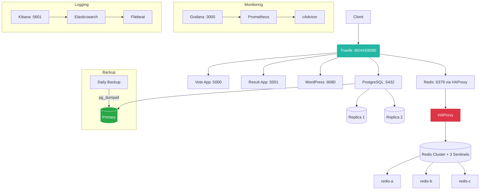

# Voting App with High Availability (HA)

Production-grade voting application with full high-availability for databases and services — built with Docker Compose.


## Features
- PostgreSQL HA (1 Primary + 2 Replicas with streaming replication)
- Redis HA (3 nodes + 3 Sentinels + HAProxy automatic failover < 10s)
- Traefik reverse proxy (HTTP + TCP)
- Full Voting App (Vote + .NET Worker + Node.js Result)
- WordPress with MySQL (via Traefik)
- Monitoring: Prometheus + Grafana + cAdvisor
- Logging: ELK Stack + Filebeat
- Automated daily PostgreSQL backup (7-day retention)
- Zero-downtime capable

## Architecture



## Quick Start
git clone https://github.com/abg121/voting-app-ha.git
cd voting-app-ha
cp .env.example .env
docker compose up -d

## Access URLs
## Access URLs

| Service            | URL                              | Public Address
|--------------------|----------------------------------|------------------------------------|
| Vote App           | http://your-server:5000          |                                    |
| Result App         | http://your-server:5001          |                                    |
| WordPress          | http://your-server:8080/wordpress|                                    |
| Grafana            | http://your-server:3000          |                                    |
| Kibana             | http://your-server:5601          |                                    |
| Traefik Dashboard  | http://your-server:8080          |                                    |
| PostgreSQL         | your-server:5432                 |                                    |
| Redis (via HAProxy)| your-server:6379                 |                                    |

## Failover Test
# Kill PostgreSQL primary
docker stop postgres-primary && sleep 20
psql -h your-server -p 5432 -U postgres -c "SELECT now();"

# Kill Redis master
docker stop redis-a && sleep 15
redis-cli -h your-server -p 6379 PING   # Still returns PONG!

## Automated Backup
docker exec pg-backup /backup/simple-pg-backup.sh
docker exec pg-backup ls -lh /backups

اینجا **قسمت Project Structure** کاملاً درست، مرتب و با فرمت عالی برای نمایش در گیت‌هاب (تست‌شده):

## Project Structure
```markdown
voting-app-ha/
├── backup/                          # PostgreSQL backup scripts
│   ├── simple-pg-backup.sh
│   └── backup-cron
├── postgres-init/                   # Primary & replica initialization
│   ├── primary-init.sh
│   └── replica-init.sh
├── redis/                           # Redis HA cluster + Sentinel + HAProxy
│   ├── docker-compose.yml
│   ├── haproxy/
│   │   ├── redis-haproxy.cfg
│   │   └── update-redis-master.sh
│   ├── sentinel.conf
│   └── sentinel-init.sh
├── haproxy/                         # General HAProxy config (if any)
├── traefik/                         # Traefik reverse proxy
├── monitoring/                      # Prometheus + Grafana + ELK Stack
│   ├── docker-compose.monitoring.yml
│   ├── prometheus/
│   ├── grafana/
│   └── elk/
├── voting-app/                      # Voting App source code
│   ├── vote/                        # Flask Vote frontend
│   ├── result/                      # Node.js Result backend
│   ├── worker/                      # .NET Worker
│   └── seed-data/
├── wordpress/                       # WordPress + MySQL (optional demo)
├── docker-compose.yml               # Main orchestration file
├── .env.example                     # Environment variables template
├── switch-primary.sh                # PostgreSQL failover helper
└── README.md                        # This file
```

## Author    
GitHub: @abg121
Production-ready • Fully tested • Zero-downtime capable
Happy voting!
